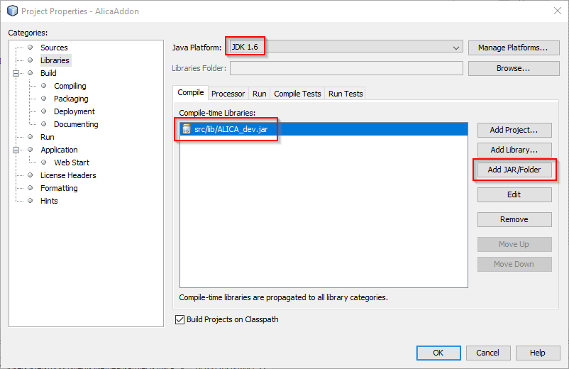
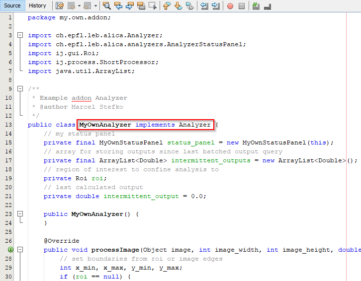
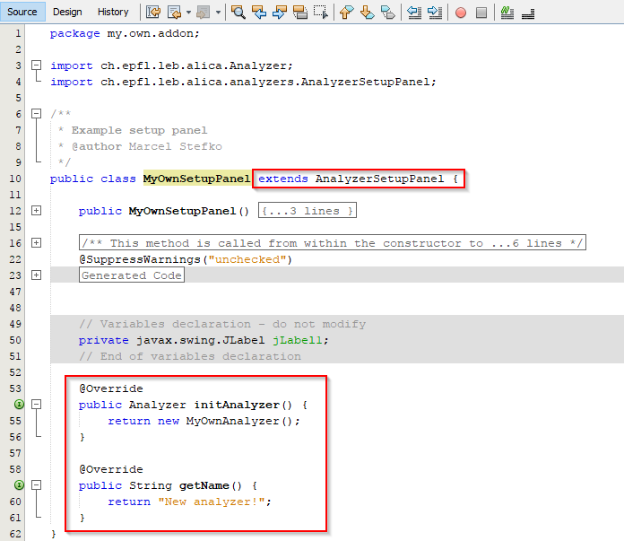
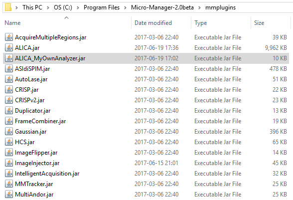
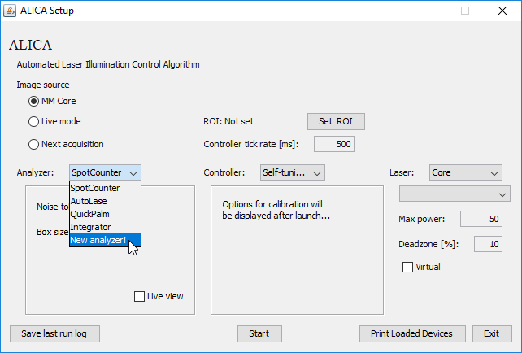

Extending ALICA
===============

This page describes how you can develop your own
ALICA Analyzer or Controller to suit your needs.

This page will guide you through the process of
creating your own Analyzer, but applies as well
to creating a Controller.

General knowledge of Java programming is assumed and recommended.

**Required JDK version:** ``1.6.0_31`` (Same as MicroManager's)

Implementing a custom Analyzer
++++++++++++++++++++++++++++++

Step 1: Importing the Analyzer interface
----------------------------------------

First, download the ``ALICA_dev.jar`` file from the relevant 
`release <https://github.com/MStefko/ALICA/releases>`_,
and include it as a resource of your project (in NetBeans,
add it to ``Project Properties -> Libraries -> Compile-time Libraries``
using the ``Add JAR/Folder`` button). This jar file contains all ALICA libraries,
as well as necessary MicroManager and ImageJ libraries.

In the same pane, you have to ensure that your JDK version is 1.6
(same as MicroManager's).

Step 2: Implementing the Analyzer and its Setup/Status panels
-------------------------------------------------------------

Implement the ``Analyzer`` interface from package ``ch.epfl.leb.alica``, and 
extend the ``AnalyzerSetupPanel`` and (optionally) ``AnalyzerStatusPanel``
abstract classes from package ``ch.epfl.leb.alica.analyzers``. Check the 
`API documentation <_javasphinx/packages.html>`_ for details. You can
also consult the source code for already implemented Analyzers 
on `GitHub <https://github.com/MStefko/ALICA/tree/master/src/ch/epfl/leb/alica/analyzers>`_.

To give a little bit of intuition, the ``AnalyzerSetupPanel`` 
serves as a Builder for Analyzers. In the Panel, the user can modify 
initial settings of the Analyzer. When ALICA ``Start`` button is clicked,
the ``initAnalyzer()`` method is triggered, which builds the Analyzer. This 
Analyzer can provide a ``AnalyzerStatusPanel``, which (if provided) is embedded
in the ALICA monitor GUI, and allows further interaction with the Analyzer.

In NetBeans, it is easier to first create a Swing JPanel form, 
implement user input fields, and then finally change the 
``implements javax.swing.JPanel`` declaration to 
``extends ch.epfl.leb.alica.analyzers.AnalyzerSetupPanel``, 
and implement the required methods (similarly for StatusPanel).

Step 3: Compiling the created Analyzer
--------------------------------------

Once all required functionality is implemented, compile the project into a
.jar file. Remember, that the jar filename **must** start with ``ALICA_``,
e.g. ``ALICA_MyOwnAnalyzer.jar``. Place this jar file into the ``mmplugins/``
folder of MicroManager.

When you launch ALICA, all added Analyzers and Controllers should be
accessible via their respective dropdown menus.

