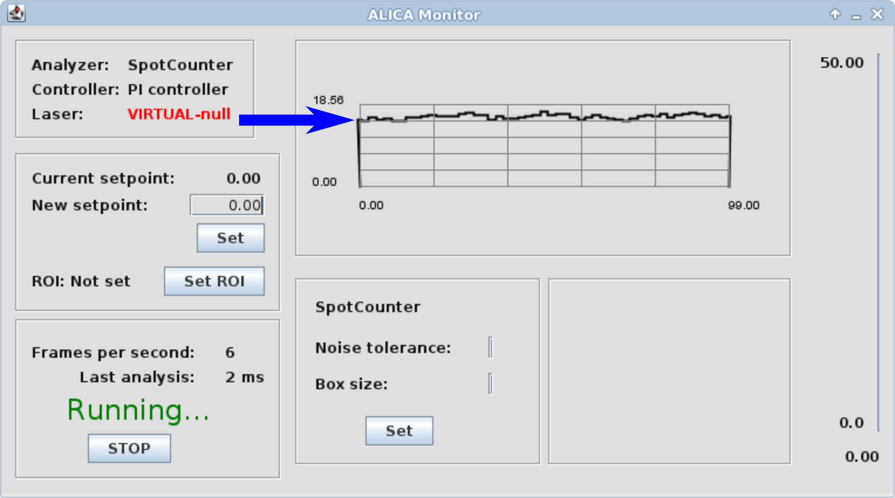

Frequently Asked Questions
==========================

General
+++++++

Doesn't AutoLase already do autonomous illumination control for STORM/PALM?
---------------------------------------------------------------------------

`AutoLase`_ was developed for one particular use-case: automated PALM
imaging of relatively sparse bacteria populations on microscopes with
small fields of view. In more general conditions, AutoLase can
completely fail to maintain an optimum illumination for STORM/PALM
imaging because it cannot easily distinguish between true fluorescence
signals and those from other sources such as fiducial markers, dust,
or sample autofluorescence. Recent advances that extend PALM/STORM to
large fields of view [#f1]_ further compound these problems because
the chances of capturing a signal from a foreign source are greatly
increased. Simply put, AutoLase cannot adequately account for sample
heterogeneity.

Recognizing that every sample has different illumination requirements
and varying degrees of noise, we developed ALICA as an extensible,
robust, and general-purpose tool for autonomous illumination control
in PALM/STORM experiments.

How do I do determine the value for the set point?
--------------------------------------------------

The set point is the value from the analyzer that the controller tries
to maintain. Because of this, the meaning of the set point will vary
depending on the analyzer you choose. For example, the set point for
the spot counter is in units of number of spots per :math:`100 \, \mu
m \times 100 \, \mu m`.

A pretty good way to empirically find the set point for any analyzer
is to perform a STORM or PALM experiment and manually adjust the laser
powers until your sample is blinking optimally. Then, use the
real-time plot in the upper right of the ALICA Monitor window and take
the y-value of the curve as the approximate value for the set
point. This value is highlighted in the figure below:

         to help determine the optimum set point.
   :align: center
   :scale: 25%

Software-specific
+++++++++++++++++

What version of Micro-Manager should I use?
-------------------------------------------

ALICA was designed to work with Micro-Manager 2.0 or greater. See the
`Micro-Manager 2.0`_ website for more information.

Why doesn't ALICA work properly when SASS is installed?
-------------------------------------------------------

SASS is a Fiji plugin providing a simulation environment that is used
to develop and test ALICA. Because of this, the SASS .jar file
contains a completely independent copy of ALICA which competes with
Micro-Manager's copy, producing unexpected behavior.

For this reason, we highly recommend installing SASS with an
installation of Fiji that is independent of the copy of ImageJ used by
Micro-Manager and ALICA.

.. _`Micro-Manager 2.0`:
   https://www.micro-manager.org/wiki/Version_2.0
.. _`AutoLase`: https://micro-manager.org/wiki/AutoLase

.. rubric:: Footnotes

.. [#f1] K. M. Douglass et al., "Super-resolution imaging of multiple
         cells by optimized flat-field epi-illumination," Nature
         Photonics 10, 705-708
         (2016). http://www.nature.com/nphoton/journal/v10/n11/full/nphoton.2016.200.html
         ; Z. Zhao et al., "High-power homogeneous illumination for
         super-resolution localization microscopy with large
         field-of-view," Optics Express 25, 13382-13395
         (2017). https://www.osapublishing.org/oe/abstract.cfm?uri=oe-25-12-13382
         ; R. Diekmann, et al., "Chip-based wide field-of-view
         nanoscopy," Nature Photonics 11, 322-328
         (2017). https://www.nature.com/nphoton/journal/v11/n5/abs/nphoton.2017.55.html

