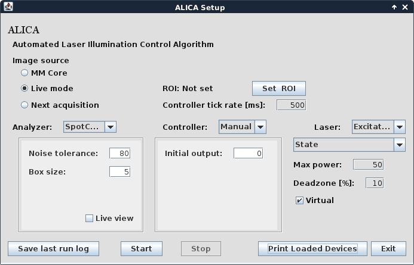
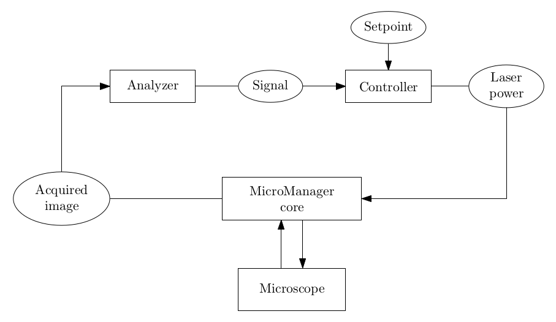

.. ALICA documentation master file, created by
   sphinx-quickstart on Wed Jun 14 20:58:11 2017.
   You can adapt this file completely to your liking, but it should at least
   contain the root `toctree` directive.

ALICA
=====

Automated Laser Illumination Control Algorithm

.. toctree::
   :maxdepth: 1
   
   quickstart
   parameters
   simulation
   extending
   faq
   _javasphinx/packages

About
=====

.. image:: _images/alica_desktop_example.png
   :alt: ALICA running on a stream of images from a super-resolution
         fluorescence microscopy experiment.
   :width: 45%

         core components.
   :width: 45%

ALICA is an open-source `Micro-Manager`_ plugin for real-time control
of single molecule photodynamics using adaptive illumination. In
particular, **ALICA enables autonomous super-resolution fluorescence
imaging using techniques such as STORM and PALM** [#RUST2006]_
[#BETZIG2006]_ [#HESS2006]_.

ALICA works by analyzing the incoming images during an acquisition to
produce an estimate of the number of fluorescence emitting molecules
in a region of interest. The estimates are then fed into a control
system that automatically adjusts the illumination intensity to
maintain the optimum density of emitting molecules for the desired
application. Example applications include

- STORM and PALM super-resolution fluorescence microscopy
- *in vitro* single molecule assays
- single particle tracking

A primary design goal of ALICA is `extensibility <extending.html>`_. 
A minimal
knowledge of the Java programming language will allow you to write
your own analyzers for deriving quantitative information from an image
stream and controllers for implementing closed-loop feedback for your
hardware. As a `Micro-Manager`_ plugin, ALICA easily integrates with
many types of cameras and illumination sources.

ALICA was designed and written by Marcel Stefko and Kyle M. Douglass
in the `Laboratory of Experimental Biophysics`_ at the EPFL to
automate the lab's STORM and PALM microscopes.

For more information, please see the `FAQ <faq.html>`_ or 
`Javadoc <_javasphinx/packages.html>`_

Acknowledgments
===============

Thanks
------

- The `Laboratory of Experimental Biophysics`_ and Suliana Manley
- The `École Polytechnique Fédérale de Lausanne <http://epfl.ch/>`_
- `Micro-Manager`_ and the Micro-Manager community
- `AutoLase <https://micro-manager.org/wiki/AutoLase>`_ by Seamus
  Holden and Thomas Pengo
- `QuickPALM <http://imagej.net/QuickPALM>`_ by Ricardo Henriques, et
  al.
- `SpotCounter <http://imagej.net/SpotCounter>`_ by Nico Stuurman

Authors
-------

- `Marcel Stefko <https://github.com/MStefko>`_
- `Kyle M. Douglass <https://github.com/kmdouglass>`_

See Also
========

- `SASS <http://sass.readthedocs.io/en/latest/>`_ - STORM Acquisition
  Simulation Software

.. _Micro-Manager: https://www.micro-manager.org/
.. _Laboratory of Experimental Biophysics: https://leb.epfl.ch

.. rubric:: Footnotes

.. [#RUST2006] M. J. Rust, M. Bates, and X. Zhuang, "Sub-diffraction-limit
         imaging by stochastic optical reconstruction microscopy
         (STORM)", Nature Methods 3, 793-796
         (2006). http://www.nature.com/nmeth/journal/v3/n10/abs/nmeth929.html
.. [#BETZIG2006] E. Betzig, et al., "Imaging intracellular fluorescent
         proteins at nanometer resolution," Science 313, 1642-1645
         (2006). http://science.sciencemag.org/content/313/5793/1642
.. [#HESS2006] S. T. Hess, T. P. K. Girirajan, and M. D. Mason,
              "Ultra-high resolution imaging by fluorescence
              photoactivation localization microscopy," Biophysical
              Journal 91, 4258-4272
              (2006). http://www.sciencedirect.com/science/article/pii/S0006349506721403
