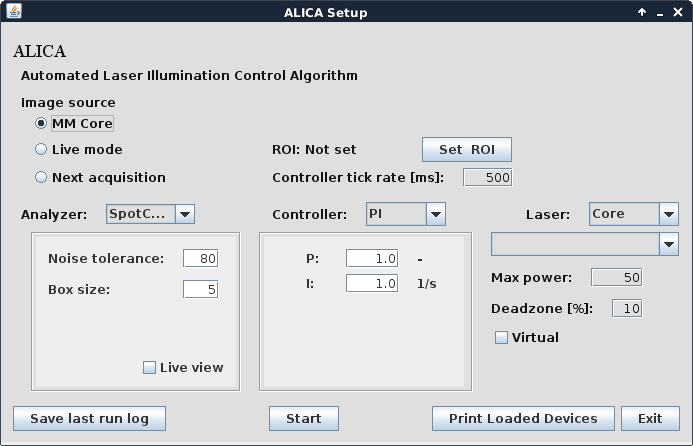
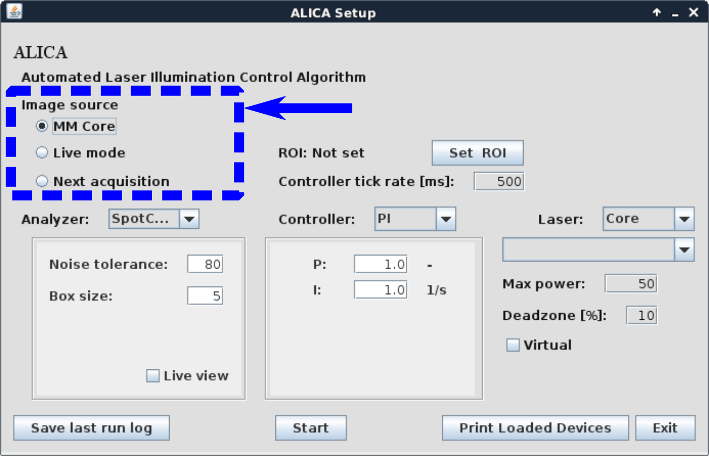
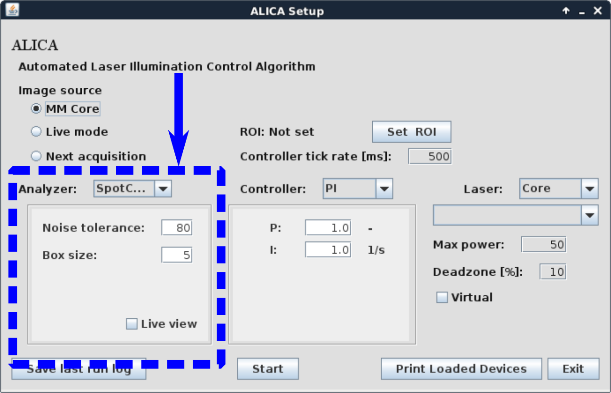
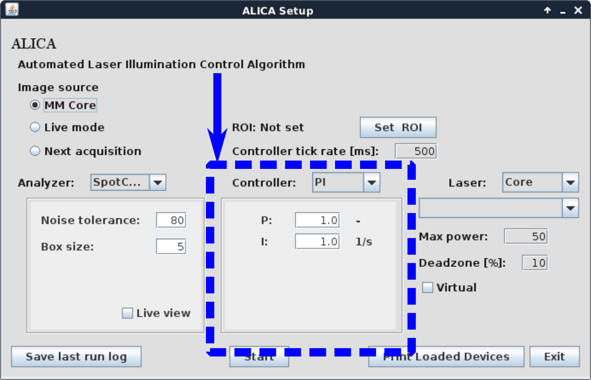
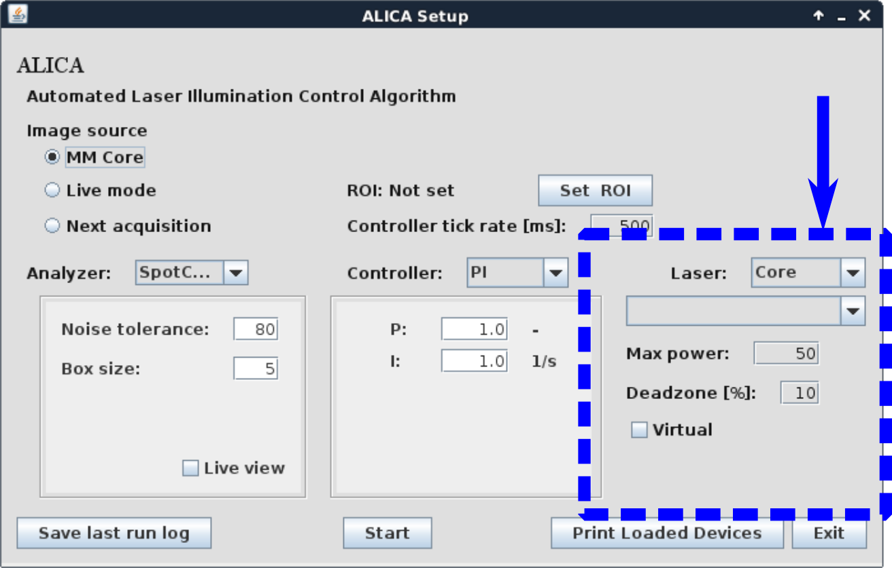
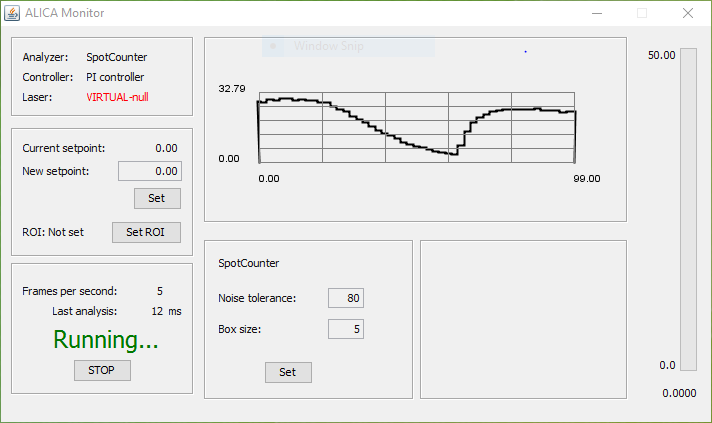
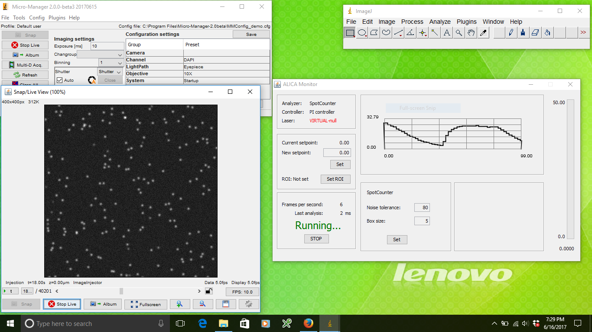

Quickstart
==========

This page describes a brief tutorial on how to install and begin
working with ALICA. It necessarily avoids any details on how ALICA
works; instead, its focus is on helping you become acquainted with
working with ALICA.

Installation
++++++++++++

Micro-Manager 2
---------------

If `Micro-Manager`_ 2.0 or greater is not already installed on your
machine, then follow the steps in this section.

1. Navigate to
   https://valelab4.ucsf.edu/~MM/nightlyBuilds/2.0.0-gamma/Windows/
   and download the latest nightly build for your system. (Note that
   ALICA currently only works with Micro-Manager 2.0gamma, **NOT**
   2.0beta.)
2. Install Micro-Manager by following the directions provided on the
   previously mentioned website. Make note of the installation
   directory, which on Windows is usually something like *C:\\Program
   Files\\Micro-Manager-2.0*.

.. _Micro-Manager: https://www.micro-manager.org/wiki/Version_2.0

ALICA
-----

ALICA is distributed as a .jar file and is easily installed by copying
the file into the Micro-Manager plugins folder.

1. Navigate to https://github.com/MStefko/ALICA/releases and download
   the ALICA*.jar file corresponding to the latest release.
2. Copy ALICA*.jar to the *MM2ROOT/mmplugins* directory, where
   *MM2ROOT/* is the Micro-Manager installation directory.
3. Navigate to https://github.com/LEB-EPFL/ALICA_ACPack and download
   the ALICA_ACPack*.jar file corresponding to the latest release.
4. Copy ALICA_ACPack*.jar to the *MM2ROOT/mmplugins* directory, where
   *MM2ROOT/* is the Micro-Manager installation directory.
5. Verify that ALICA was installed and recognized by starting
   Micro-Manager and selecting *Plugins > Device Control > ALICA* in
   the Micro-Manager menu bar. (ALICA will not be located in the
   ImageJ menu bar.) The ALICA Setup window should appear, which will
   verify that ALICA is properly installed.

         ALICA was properly installed.
   :align: center
   :scale: 75%

Using ALICA
+++++++++++

ALICA reads an image stream from Micro-Manager and uses these images
to estimate the real-time density of fluorescence emitting molecules
within the microscope's field of view. As the estimated density of
emitting fluorophores changes (due to bleaching or changes in the
sample, for example), ALICA will automatically adjust the laser power
to maintain a set emitter density.

Step 1: Select an image source
------------------------------

First, select a source for the image stream that ALICA will
analyzer. Your options include

1. the Micro-Manager core, which contains unprocessed images from the
   camera;
2. the Micro-Manager Live mode, which contains the images that appear
   in Micro-Manager's Snap/Live View window. These images may be
   preprocssed by Micro-Manager's On-The-Fly Image Processors;
3. the next Multi-Dimensional Acquisition.

We suggest choosing the **Live mode** option when you are just
starting to use ALICA because it is the most interactive option.
During actual acquisitions, **MM Core** is recommended due 
to its superior performance, unless you need
to perform some image preprocessing using the MicroManager
processing pipeline before feeding the images to ALICA.

Step 2: Select and configure the analyzer
-----------------------------------------

An analyzer is an algorithm that estimates the density of fluorophores
that are visible in an image. At the time of this writing, ALICA
included the following analyzers

1. a spot counter, which counts the number of fluorescent spots in the
   images;
2. AutoLase, an algorithm which estimates fluorophore densities by
   identifying the single pixel within the field of view that has been
   above a given threshold for the longest time;
3. `QuickPALM`_, a tool which identifies fluorescent spots and then
   performs a subpixel localization of each spot;
4. an integrator, which simply computes the integrated intensity of an
   image.

The **spot counter** performs well for many samples and also offers a
live view which provides real-time visual feedback of which spots it
identifies.

         the analyzer.
   :align: center
   :scale: 40%

Step 3: Select and configure the controller
-------------------------------------------

A controller is a feedback loop that adjusts the laser power so that
the estimated density of emitters remains as close as possible to a
previously determined set point. The difference between the current
estimate and the set point is called the error signal. The choice of
controllers includes

1. a proportional-integral (PI) controller, which responds both
   proportionately to the error signal and to the time integral of the
   error signal;
2. a manual controller, which gives control over the laser to the
   microscopist;
3. an inverter, which adjusts the laser by a factor that is
   proportional to the inverse of the error signal (e.g. high error
   signal > low laser power and vice versa);
4. a self-tuning (PI) controller, which uses a pulse of laser light to
   estimate the optimum values for the P and I parameters.

We recommend starting with **manual** control to first learn how the
analyzer responds to changes in your sample. Once you understand a
little bit about this, you can try a **self-tuning PI
controller**. The self-tuning PI controller can only tune itself when
the sample is already under STORM or PALM imaging conditions. For
direct STORM, this means that the fluorophores should already be
blinking.

         the controller.
   :align: center
   :scale: 40%

Step 4: Select the device to be controlled
------------------------------------------

A device and its property that corresponds to output power needs to be
specified for the controller to actually do something. In most STORM
and PALM experiments, the density of emitters is typically controlled
using an ultraviolet laser. To be able select this laser, it needs to
be added to the current Micro-Manager hardware configuration. Once the
laser is selected, choose its power setting from the next drop-down
menu.

To prevent a run-away laser illumination, you can set the maximum
power for the controller. We typically do not set this above a few
tens of milliWatts, but the actual value depends on the sample.

If you are testing ALICA and do not want to select a device, then
check the *Virtual* checkbox. This will instruct the controller that
it should not affect the state of any hardware devices. Checking it
will allow you to test ALICA's analyzers without performing any
hardware control.

         the laser device.
   :align: center
   :scale: 40%

Step 5: Start the monitor
-------------------------

When ready, click *Start* in the ALICA Setup window. This will open
the ALICA monitor window, which will look similar to the image below.

In the upper left, you can find a readout on the currently selected
analyzer, controller, and laser. In this example image, the analyzer
is the SpotCounter, controller is a PI controller, and the device is
actually not set, i.e. the *Virtual* checkbox was checked in the ALICA
Setup window.

Below this box you can set the desired density of fluorophores in the
*New setpoint:* text box. After typing in a new value, click *Set* to
activate the change. If you draw a region of interest (ROI) in the
Snap/Live View window, you can set ALICA to only analyze this region
by clicking the *Set ROI* button. You can also drag this ROI around
the the Snap/Live View window in real-time and ALICA will respond in
real-time.

Moving further down the left-hand side of the ALICA Monitor window,
you will find information on the number of frames processed by the
analyzer per second and the time taken to analyze the last frame. You
may also close the ALICA Monitor window in this section by clicking
the *Stop* button.

In the middle of the ALICA Monitor window on the top is a real-time
plot of the output of the analyzer as a function of time. The units on
the y-axis of this plot will depend on the output of the analyzer. For
example, the SpotCounter outputs a number of spots, but AutoLase will
output the longest "On" pixel in units of time.

Below this plot you may update the analyzer settings.

Finally, on the far right of the ALICA Monitor window is a status bar
that reflects the current output of the laser. The maximum value of
the status bar is the maximum value set in the ALICA Setup window.

Step 6: Start taking images
---------------------------

When you are ready, start taking images using the source of images
that you set in the ALICA Setup window. For example, if you selected
*Live mode*, then all you need to do is start a Live stream in
Micro-Manager. The different parts of the ALICA Monitor window will
begin to reflect the output of the analyzer and controller once images
begin arriving in this stream.

If the controller was set to Manual, try adjusting the ultraviolet
laser power and watching how the output of the analyzer changes in
response. If you are using a PI controller, you may notice a slight
oscillation in the readout of the analyzer. This is caused by the
particular values you have set for P and I.

If you selected a self-tuning PI controller, Micro-Manager will pulse
the laser a short time after the acquisition has started and observe
how the density of fluorophores changes in response to the pulse. It
will then determine the optimum values for P and I. You may set the
set point after the controller has tuned itself.

What's next?
++++++++++++

Tuning the parameters in ALICA may take some time and experimentation,
even with the self-tuning controller. Tuning may not be easy to do on
real samples due to time constraints and costly sample
preparations. To ease this process, we created a simulation
environment to help you learn how ALICA works.

You may read about how to setup this environment on the `simulation
<simulation.html>`_ page.

.. _QuickPALM: http://imagej.net/QuickPALM
