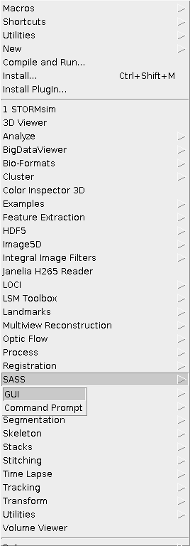
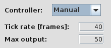
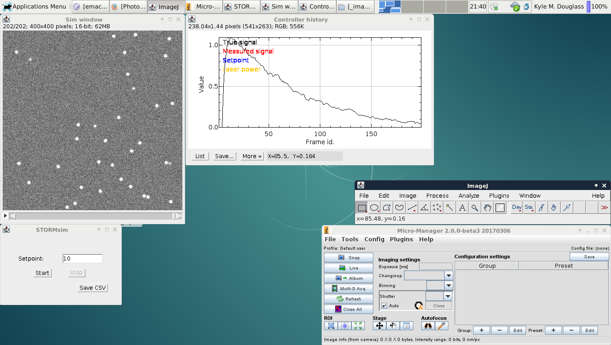
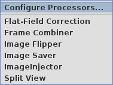
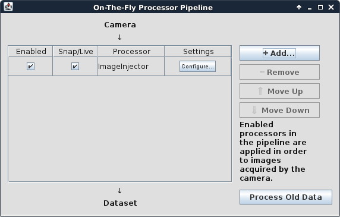

Photophysical Simulations with ALICA and SASS
=============================================

Extensibility is a core design principle of ALICA. If the builtin
components do not suit the needs of your application, then you can
write your own set of tools using the frameworks of ALICA and
`Micro-Manager`_. Alternatively, you may find that ALICA already suits
your needs but you need to do some testing in a controlled environment
prior to using it in your measurements. We developed the **STORM
Acquistion Simulation Software** (`SASS`_) to assist in both of these
situations.

This document explains how to setup SASS to test ALICA in a fully
controlled simulation environment.

Install the Simulation Environment
++++++++++++++++++++++++++++++++++

SASS and ALICA are both distributed as Java .jar files. In addition to
these you will need to download our Image Injector plugin, a
Micro-Manager plugin which allows you to simulate acquistions by
feeding images from a .tif file into the Micro-Manager live window. To
install these files, you simply download the latest .jar from the
Releases page of the respective projects and copy the files into the
appropriate directories.

Micro-Manager 2
---------------

Before starting, you need the latest nightly build of Micro-Manager
2.0 (or higher). 

1. Go to https://www.micro-manager.org/wiki/Version_2.0 and download
   the latest nightly build for your system.
2. Install Micro-Manager. Make note of the installation directory
   since you will need it later to install the .jar files.

ALICA
-----

1. Navigate to https://github.com/MStefko/ALICA/releases and download
   ALICA.jar from the latest release.
2. Copy ALICA.jar to the *MM2ROOT/mmplugins* directory, where *MM2ROOT*
   refers to the installation directory of Micro-Manager.

SASS
----

1. Navigate to https://github.com/MStefko/SASS/releases and download
   SASS_VERSION.jar from the latest release. VERSION will vary
   depending on the latest release.
2. Copy the SASS .jar file to *MM2ROOT/plugins* directory. (Note that
   the folder this time is **plugins**, not **mmplugins**.) This will
   install SASS as an ImageJ plugin.

Image Injector Plugin
---------------------

1. Go to https://github.com/MStefko/ImageInjectorPlugin/releases and
download the ImageInjector.jar file from the latest release.
2. Copy the .jar file to the *MM2ROOT/mmplugins* directory.

Simulation Workflow
+++++++++++++++++++

The workflow goes as follows:

1. Use SASS to simulate a time series image stack of a PALM or STORM
   experiment and save the stack as a .tif file.
2. Use the Image Injector Plugin to feed the images in the stack into
   the Micro-Manager live window.
3. Run ALICA in virtual mode and observe how it responds to the
   simulated conditions in the image stack.

Step 1: Simulate a PALM/STORM Experiment with SASS
--------------------------------------------------

If you do not already have a .tif file of a time series image stack
from a PALM/STORM experiment, you can simulate one by following the
steps in this section.

1. Launch Micro-Manager. It must be launched as an ImageJ plugin
   (which is the default behavior) in order to create the simulated
   image stacks.
2. Select the MM Demo Configuration as a hardware configuration and
   click *OK*.
3. Verify that the SASS plugin is recognized by ImageJ and runs by
   clicking to *Plugins > SASS > GUI* **in the ImageJ menu bar, not
   the Micro-Manager menu bar.**

4. The GUI configuration window for the SASS simulation environment
   should appear. Select your parameters for the simulation. A full
   description of the simulation parameters is outside the scope of
   this documentation. However, you will want to set the Controller
   setting to **Manual** since we will eventually test ALICA's
   controllers, not SASS's.

         for the Max output parameter
   :align: center

5. Remember the value for the *Max output* parameter. This is the
   maximum output power of the simulated laser, and you will need it
   for step 7.
6. Once everything is set, click the *Initialize* button to initialize
   the simulation.
7. Set the *Set Point* value to something smaller than the value of
   *Max output*. This value determines the output power of the
   simulated laser.
8. When ready, start the simulation by clicking the *Start*
   button. This will begin to populate an image stack with simulated
   STORM/PALM images.

         and ImageJ windows.
   :scale: 50%
   :align: center

9. You may stop the simulation and change the laser output power by
   clicking *Stop* in the STORMsim window and adjusting the set point.
10. Once you have simulated a desired number of images in the stack,
    save the image stack by navigating to *File > Save As > Tiff...*
    in the ImageJ menu bar.

From this point you have two options for further exploration. You can
use SASS to directly test the different analyzers and controllers. Or,
you can continue further to directly test ALICA in a simulated
Micro-Manager acquisition.

Step 2: Setup the Image Injector Plugin
---------------------------------------

Once you have a .tif stack, the next step is to setup the image
injector to simulate a Micro-Manager acquisition.

1. Open the *On-The-Fly Processor Pipeline* window by navigating to
   *Plugins > On-The-Fly Image Processing > Configure Processors...*
   **in the Micro-Manager menu bar.**

         Plugins > On-The-Fly Image Processing menu item.
   :align: center

2. In the window that appears, verify whether an ImageInjector
   processor already exists in the pipeline. If not, add one by
   clicking *+ Add... > ImageInjector*.

3. Click the *Configure...* button for the ImageInjector processor.
4. In the dialog that appears, click the *Choose file...* button and
   select the .tif stack of images to inject.
5. We find that it helps to set the *Frames per second* value to
   something small during your initial tests, such as 5.
6. Click *OK* when you are finished configuring the processor. You may
   close the configuration window at this point.
7. Click the *Live* button in the Micro-Manager GUI window. You should
   now see the images from the .tif stack stream through the Snap/Live
   View window.
8. You can stop and restart the live stream at will. The stream will
   cycle back to the start of the image stack once the end is reached.

Step 3: Launch ALICA in Virtual Mode
------------------------------------

Now that Micro-Manager has been setup to stream pre-generated images
through its Snap/Live View window, we can launch ALICA and run it in
virtual mode.

1. Navigate to *Plugins > Device Control > ALICA* in the Micro-Manager
   menu bar.
2. Select *Live mode* as the Image source and check the *Virtual* box
   under the options for the control device.

.. image:: _images/alica_setup_virtualmode.png
   :alt: Settings to run ALICA in virtual mode.
   :align: center

3. Click *Start*. This will open the monitor window which provides
   real-time reports about the ALICA's operation, such as fluorophore
   density estimates and the laser power.
4. Click the *Live* button in the main Micro-Manager GUI window. You
   should see the reports in ALICA's Monitor window respond to changes
   in the images streaming through the Snap/Live View window.
5. When you want to close the Monitor window, first click *Stop* in
   the ALICA Setup window.

What's Next?
++++++++++++

Now that everything is setup, here are some further things that we
recommend playing with to better understand how ALICA works.

- Check the *Live view* checkbox in the SpotCounter analyzer settings
  for a live view of the identified spots.
- Change the Analyzer from SpotCounter to AutoLase or QuickPALM for
  ways to estimate fluorophore densities in the images.
- Try ALICA's virtual mode on actual experimental image stacks.
- Restrict the fluorophore density estimates to a subregion of the
  images by selecting a rectangular region in the Snap/Live View and
  clicking the *Set ROI* button in the ALICA Monitor window. The best
  way to see how this works is to use Spot Counter's *Live view*
  setting. You can even drag the region around the field of view and
  watch the changes reflected in the SpotCounter's live view in
  real-time.
- Use SASS to directly test different Analyzer and Controller
  settings outside of ALICA.

.. _Micro-Manager: https://www.micro-manager.org/
.. _SASS: https://github.com/MStefko/SASS
